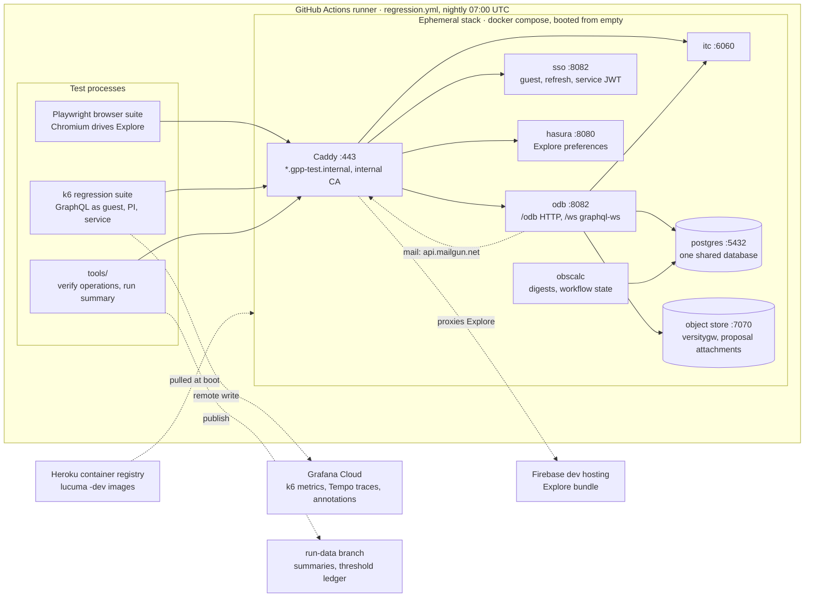
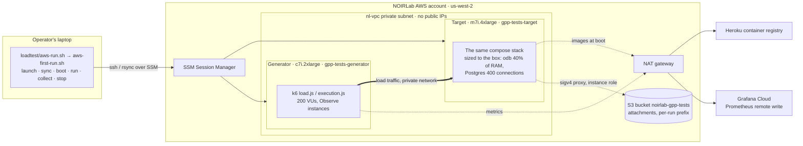
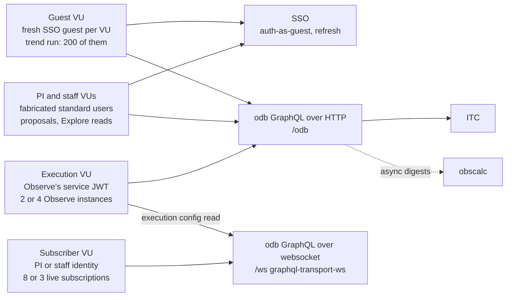
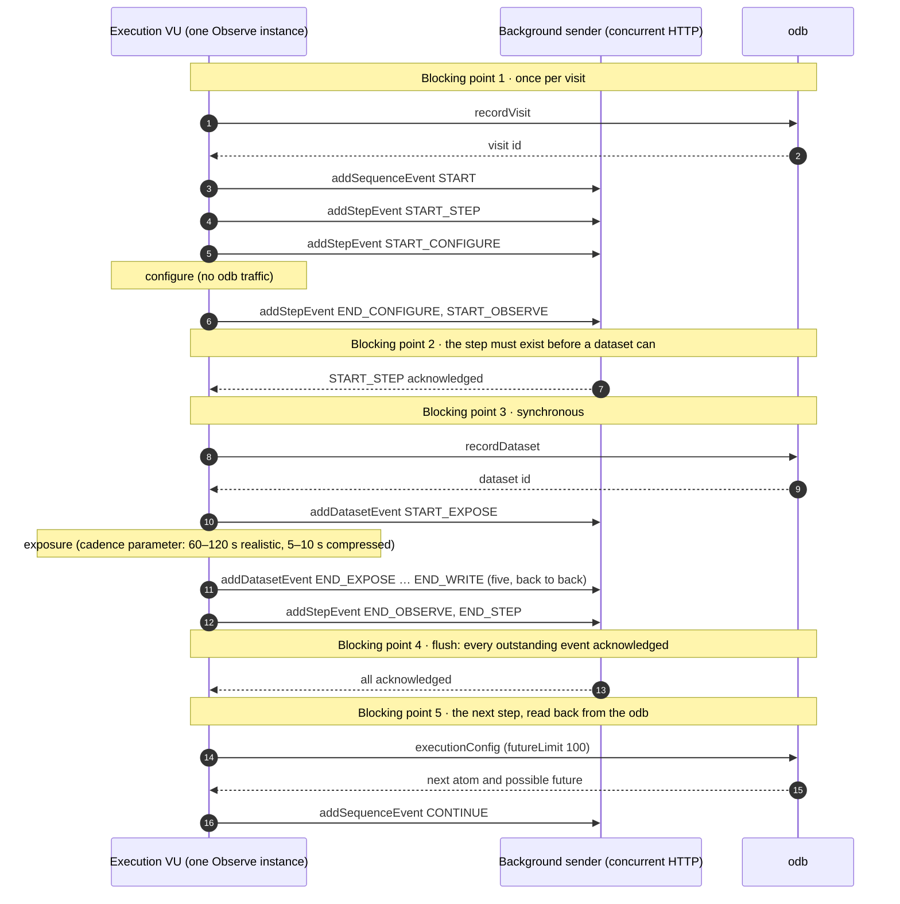
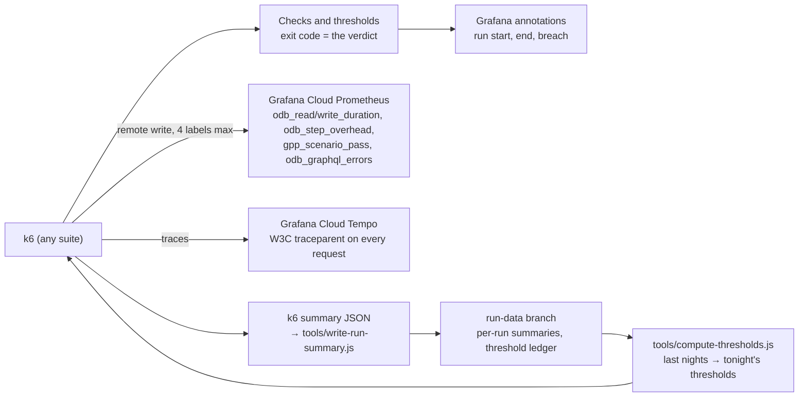

# gpp-tests architecture

How the test system is put together: which suites exist, which hosts they run on, how those
hosts talk to each other, and where the traffic they generate goes. Decisions and their
reasons live in [`wayfinder/`](wayfinder/map-gpp-tests.md) and the
[spec](gpp-testing-system-spec.md); this is the map of what runs where. As of 2026-10-03.

## Overview

gpp-tests is one repository that tests the GPP (lucuma) services from the outside, through
the interfaces their real clients use: Explore's browser UI, the odb's GraphQL API over HTTP
and websocket, and the traffic Observe's server produces while executing a sequence. Every
suite imports the same operations library, so what the browser suite asserts and what the
load suites send cannot drift apart.

Three suites, two claims:

- **Browser suite** (Playwright) drives Explore through its `data-testid` contract: the v1
  scenarios, the proposal flow, an observation in every observing mode.
- **k6 regression suite** runs the same scenarios at the GraphQL layer once per night, as a
  guest and as a fabricated PI, plus one executed step as Observe's service identity and one
  Observe-browser websocket session.
- **k6 load suites** make the performance claims. The **trend run** (200 guest VUs) says
  "tonight is slower than last night". The **surge run** (on demand; its populations exist, the
  composed profile is ticket 018) says "under
  end-of-CfP load, with both telescopes executing through Observe, the odb keeps execution
  within its stall budget, proposal submission usable and regular operations within spec".

The regression suites run against a throwaway stack booted inside CI. The load suites run
against a dedicated target on AWS, with k6 on a second instance beside it.

## The pieces

| Part | Where | What it does | Runs on |
|---|---|---|---|
| Shared library | `lib/` | Every GraphQL document and payload (`odb-operations.js`, validated offline against the vendored odb schema), endpoints, the metric-label budget, the scenario parity catalog, run identity, threshold calibration | Imported by every suite; pure JavaScript, no dependencies |
| Browser suite | `tests/` | Playwright journeys against Explore; selectors only through Explore's `data-testid` contract | GitHub runner, nightly |
| k6 regression | `k6/regression.js` | The same scenarios at the GraphQL layer, 14 observing modes, one Observe step, one websocket session | GitHub runner, nightly, after the browser suite |
| k6 load | `k6/load.js`, `k6/execution.js`, `k6/subscribers.js` | The 200-VU trend profile; Observe execution instances; the websocket subscriber population with churn; the composed surge profile to come (018) | AWS generator instance, on demand |
| Ephemeral stack | `stack/` | Compose file, Caddy, bootstrap scripts: boots the eight services from empty (the eighth is the object store for attachments; Caddy also stands in for Mailgun), mints keys and the service JWT, fabricates standard users | Inside the GitHub runner; locally; on the AWS target |
| Tools and CI | `tools/`, `.github/` | Replay operations at boot, compute thresholds from the ledger, write run summaries, post Grafana annotations; `regression.yml`, `performance.yml` | GitHub Actions |
| AWS runner | `loadtest/aws-run.sh`, `loadtest/aws-first-run.sh` | The standard unattended run (regression, execution, subscribers, stop) and the wizard behind it, interactive when wanted, under NOIRLab's launch procedure | Operator's laptop, over SSM |

## Where it runs: the regression path

The nightly regression run needs no shared environment. One GitHub runner boots the whole
lucuma stack from the `-dev` images, runs the browser suite and then the k6 suite against it
through Caddy, publishes results, and throws the stack away.

Caddy fronts every service under `*.gpp-test.internal` with its own CA, so the suites use one
hostname scheme locally, in CI and on AWS. Explore does not run in the stack: Caddy proxies
Firebase's dev hosting, so the browser suite tests the Explore build that is actually
deployed. Bootstrap mints the SSO keypair and the service JWT, waits for all eight services,
replays every GraphQL operation as a contract check, and fabricates the PI and staff users
the suites log in as.

Two things the stack answers for itself ([ticket 028](wayfinder/tickets/028-object-store-and-attachment-uploads.md)).
Proposal attachments go to its own object store: versitygw here, the real bucket through a
re-signing proxy on AWS; the odb is pointed at either by `AWS_ENDPOINT_URL_S3`. And the odb's
emails — it sends one on every proposal submission, to a hardcoded Mailgun URL — go to Caddy,
which answers as `api.mailgun.net` inside the compose network and records each message in a
log it serves at `mail.gpp-test.internal`, so a test can assert what was sent. No email can
leave the stack: the name never resolves to Mailgun from inside, the API key is a dummy, and
the recipients are the fabricated users' stack-local addresses.

## Where it runs: the AWS load target

The load suites need hardware with headroom and a network without jitter, so both the stack
and k6 run on EC2 in NOIRLab's shared AWS account, in `us-west-2`, under IT's launch
procedure: launched only through the `NOIRLab-Software-GPP` launch template, in a private
subnet with no public IP, reachable only over SSM. Today one command from a laptop runs it
unattended (`loadtest/aws-run.sh`: boot, regression, execution, subscribers, collect, stop); a
workflow-driven run waits on IT granting CI an identity ([ticket 016](wayfinder/tickets/016-automate-aws-load-target.md))
and will call the same script.

Both instances sit in one availability zone and are stopped between runs. The generator is a
separate box because k6 on the target would share the CPU it is measuring, and k6 on a
hosted GitHub runner would add internet latency to every sample. Results come back two ways:
k6 streams metrics to Grafana Cloud during the run, and the wizard copies the k6 summaries,
logs and the target's container-memory samples back over SSM into `out/`. The only things that can be stopped or terminated by the tooling are instances
tagged `gpp-tests:loadtest=1`, and the wizard re-checks that tag before every such call.
Proposal attachments written during a run go to the `noirlab-gpp-tests` bucket under a prefix
of the run's own, through the stack's re-signing proxy and the target's instance role — the
odb itself cannot use the bucket, it pins region us-east-1 and static keys — and the wizard
prints what was uploaded and deletes the prefix at teardown.

## How traffic flows: the virtual users

Each k6 VU type impersonates one real client of the odb and carries that client's identity.
Identities are per VU and never shared.

| VU type | Identity | What it sends | Suite |
|---|---|---|---|
| Guest | A new SSO guest per VU, refreshed via its cookie | Creates programs, targets and observations, then a 60/40 read/write mix of what Explore issues when a program opens | Trend run, regression |
| PI / staff | Users inserted into the SSO database at bootstrap, 1-hour JWTs via refresh token | Proposals against a call, observations in every observing mode | Regression; surge proposal loop (ticket 017) |
| Execution | The service JWT the stack mints for odb, itc and obscalc | One Observe instance's events: visit, sequence, step and dataset events, dataset records, execution-config reads | Execution profile, regression smoke, surge |
| Subscriber | PI (Explore tab) or staff (Observe browser) | Long-lived `graphql-transport-ws` subscriptions, eight per tab and three per browser; edits on a cadence measure the round trip from a mutation's ack to the matching event, pings measure the socket | Subscriber profile, regression smoke, surge |

## The execution VU: one step as Observe performs it

Observe's server hands every event mutation to a background sender and does not wait for the
round trip. The sequence blocks on the odb at five points, and their sum per step is the
**step ODB overhead**, the telescope's stall metric (`odb_step_overhead`, broken down per
point in `odb_step_wait`). This is the model in `k6/lib/execution.js`, verified against
lucuma-apps main of 2026-10-02.

Every mutation carries a UUID idempotency key in its variables and in the `Idempotency-Key`
header, and the VU retries a timed-out request once with the same key, as Observe's HTTP
client does. The seed creates GMOS long-slit observations as the service role and polls the
execution config until the odb serves one; no workflow state transitions are needed. The
execution-config read goes over the instance's own `graphql-transport-ws` socket, as
Observe's does; the client is the same one the subscriber VUs use (`k6/lib/graphql-ws.js`).

## Telemetry and verdicts

A run leaves three records, and each suite's verdict is computed from them.

- **Labels are budgeted.** Every k6 tag becomes a Prometheus label on a shared free-tier
  stack, so `lib/tags.js` allows exactly four keys: `suite`, `scenario`, `operation`,
  `status`. Run identity lives on annotations, not labels.
- **Trend thresholds come from the ledger.** The nightly load run reads its own history from
  the `run-data` branch and fails when tonight is slower than the recent nights. The first
  nights run threshold-free.
- **Surge SLOs are absolute**, per traffic class, in one file (ticket 023). The execution
  class's provisional budget is step ODB overhead p95 < 2 s and p99 < 5 s.
- **A functional floor is always armed.** The odb answers a rejected operation with HTTP 200
  and an `errors` array, so every suite thresholds on k6 checks, not on `http_req_failed`.

## Where decisions live, and what is next

| Question | Where the answer is |
|---|---|
| Why these suites, this stack, these scenarios | [`gpp-testing-system-spec.md`](gpp-testing-system-spec.md) |
| What is being built now, in what order | [`wayfinder/map-gpp-tests.md`](wayfinder/map-gpp-tests.md), "Frontier now" |
| Why stress testing first, in one repo | [ticket 020](wayfinder/tickets/020-decide-stress-first-placement-and-surge-claim.md) |
| How the AWS target works and what IT allows | [ticket 016](wayfinder/tickets/016-automate-aws-load-target.md), [`research/aws-load-target-options.md`](research/aws-load-target-options.md) |
| The execution model and its first numbers | [ticket 021](wayfinder/tickets/021-observe-execution-vus-and-seed.md) |
| The websocket client, the subscriber shapes and their first numbers | [ticket 022](wayfinder/tickets/022-graphql-ws-client-and-subscriber-vus.md) |
| The object store, the attachment uploads, the Mailgun stand-in | [ticket 028](wayfinder/tickets/028-object-store-and-attachment-uploads.md) |
| Why the odb's memory grows to its limit, and the heap cap | [`research/odb-memory-growth-handoff.md`](research/odb-memory-growth-handoff.md) |
| Domain vocabulary | [`CONTEXT.md`](CONTEXT.md) |

Next on the frontier: standard users and proposals in k6 (017), now that the object store and
the uploads exist (028), then the surge profile that composes execution, subscribers and
proposals over the regular mix, and its SLO file (018, 023). In parallel, IT's answer on a CI
identity for AWS (016).
